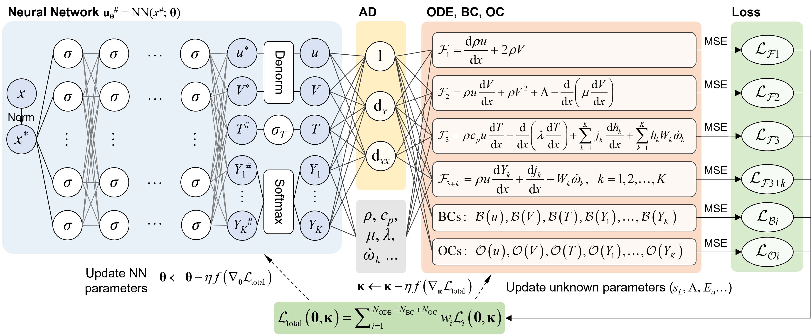
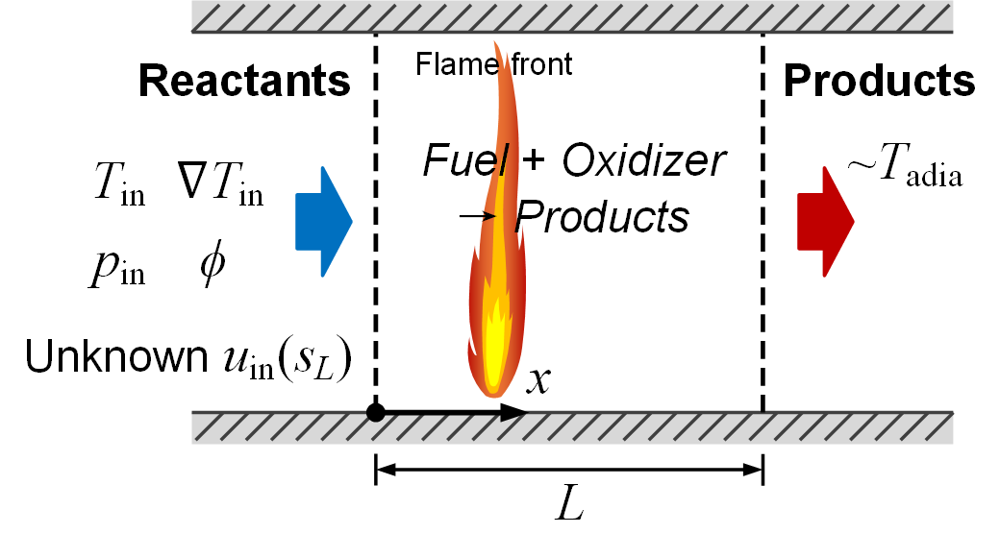
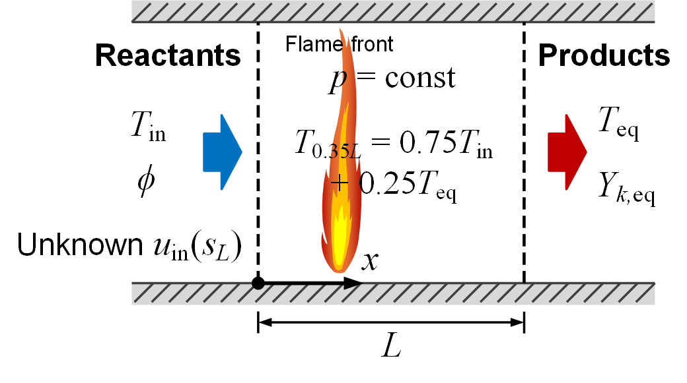
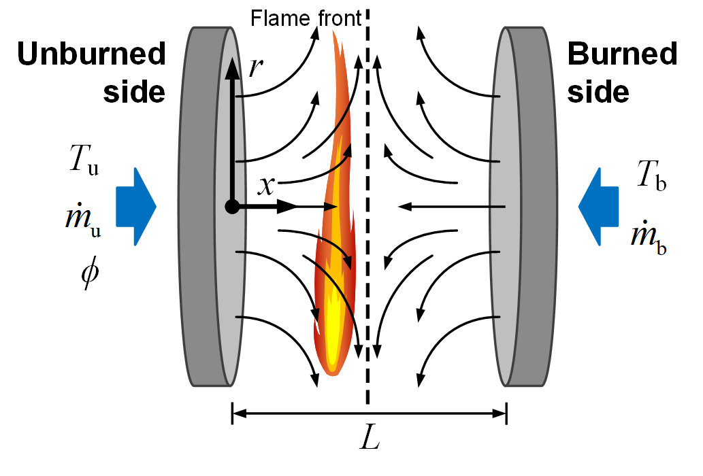

# FlamePINN-1D
Physics-informed neural networks to solve forward and inverse problems of 1D laminar flames.

Codes for the paper: [*FlamePINN-1D: Physics-informed neural networks to solve forward and inverse problems of 1D laminar flames*](https://doi.org/10.1016/j.combustflame.2025.113964).

Preprint version: [https://arxiv.org/abs/2406.09071](https://arxiv.org/abs/2406.09071).

The mechanism file (1S_CH4_MP.yaml) must be copied to the mechanism folder of Cantera. (When using Windows with Anaconda, the folder path is: "...\anaconda\Lib\site-packages\cantera\data\\".)

Framework:

Flames:

Case 1 (simplified freely-propagating premixed flames):

Case 2 (detailed freely-propagating premixed flames):

Case 3 (detailed counterflow premixed flames):

